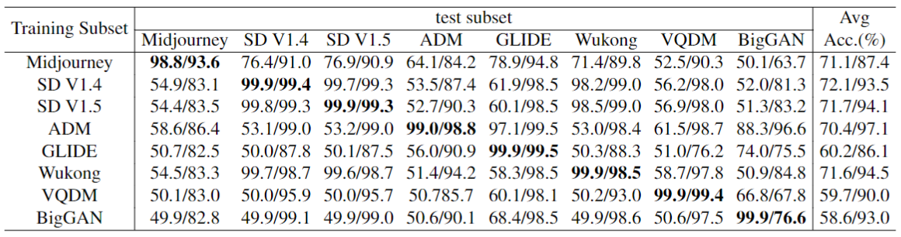

# SSP-AI-Generated-Image-Detection

This is the official implementation for the following research paper:

> **A Single Simple Patch is All You Need for AI-generated Image Detection** [[arxiv]](https://arxiv.org/pdf/2402.01123.pdf)
>
> Jiaxuan Chen, Jieteng Yao, and Li Niu<br>

Note that in the paper, we proposed Enhanced SSP (ESSP) to improve its robustness against blur and compression. Currently, we only release the code of SSP. The code of ESSP will be released soon. 

<div align="center">
  
</div>

## Environment setup
You can install the required packages by running the command:
```bash
pip install -r requirements.txt
```
## Dataset
The training set and testing set used in the paper can be downloaded in [GenImage](https://github.com/GenImage-Dataset/GenImage). This dataset contains data from eight generators. 
After downloading the dataset, you need to specify the root path in the options. The dataset can be organized as follows:
```bash
GenImage/
├── imagenet_ai_0419_biggan
    ├── train
        ├── ai
        ├── nature
    ├── val
        ├── ai
        ├── nature
└── imagenet_ai_0419_sdv4
    ├── train
        ├── ai
        ├── nature
    ├── val
        ├── ai
        ├── nature
└── imagenet_ai_0419_vqdm
    ...
└── imagenet_ai_0424_sdv5
    ...
└── imagenet_ai_0424_wukong
    ...
└── imagenet_ai_0508_adm
    ...
└── imagenet_glide
    ...
└── imagenet_midjourney
    ...
```
## Train and val
You can simply run the following line to train and val your model:
```bash
sh train_val.sh
```
## Test
You can simply run the following line to test your model:
```bash
sh test.sh
```
Our pretrained models on eight dataests can be downloaded in [Baidu Cloud](https://pan.baidu.com/s/1Wk2Cqeav_wVxPMPNy-zHZQ?pwd=bcmi)(code:bcmi)

## Results of our method
The results of ResNet50 and out SSP method with different training and test subsets. In each slot, the left number is the result of ResNet50. For each test subset, the bect results are highlighted in boldface.
<div align="center">
  
</div>
